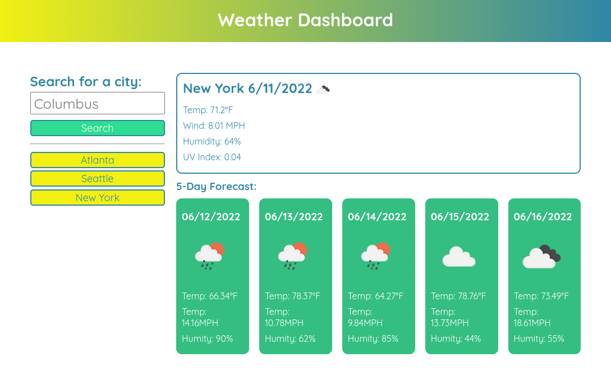

# weather-dashboard

## Description

To use the [OpenWeather One Call API](https://openweathermap.org/api/one-call-api) to retrieve weather data for cities. Save the searched cities into `localStorage` and display them on the screen. The Mapquest API was used for geocoding the city name entered in to the input box.

## Usage

Enter a city name in to the input box and click the search button. If there have been any search performed in the past, the cities will be listed below the the search button. The previous searches can be click on to quickly find the weather of the selected city.

NOTE: Click image to go to live site

## Credits

[OpenWeather One Call API](https://openweathermap.org/api/one-call-api)\
[MapQuest Geocoing API](https://developer.mapquest.com/documentation/geocoding-api)

I take credit for developing this web app.

## License

